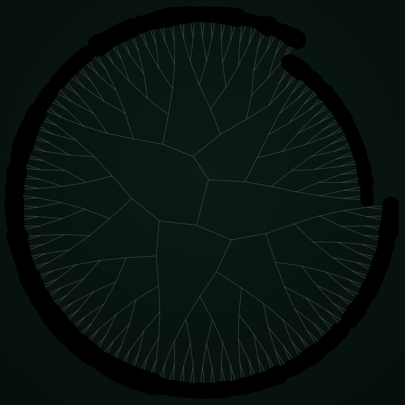

# Mitosis Lab

**▶ Live demo — [apps.charliekrug.com/mitosis-lab](https://apps.charliekrug.com/mitosis-lab/)**

[](https://github.com/ctkrug/mitosis-lab/actions/workflows/ci.yml)
[](LICENSE)

Watch one cell branch into a lineage. Seed a single cell, tune its biology
(mutation rate, division timing, timing jitter) and watch a living lineage tree
branch and grow in real time. Every node is a cell, every fork is a division,
and every colour shift is an inherited mutation propagating down the family.



*A real run, rendered by the actual simulation and radial layout (see
[`scripts/render-sample.ts`](scripts/render-sample.ts)). Green nuclei are the
founding lineage; the drift toward cyan and yellow is accumulated mutation.*

## Why it's not a particle toy

Mitosis Lab models an actual biological process, not decoration:

- **Stochastic division timing.** Cells do not divide on a metronome. Each
  cell's interval is drawn from a mean with jitter, so the colony grows in
  uneven, lifelike waves.
- **Inherited, drifting traits.** Every daughter gets a mutated copy of its
  mother's genome (hue, size, division bias). Mutations show up as gradual
  colour and shape lineages, not random noise on each cell.

What you watch is a genealogy, the same branching structure biologists call a
*lineage tree*, drawn live so you can see how one knob reshapes an entire
population's history.

## Features

- **Live lineage tree.** A single seed cell blooms into a branching genealogy,
  laid out as a radial dendrogram on Canvas with smooth birth tweens as new
  divisions land.
- **Biology you can tune.** Sliders for mutation rate, mean division interval,
  timing jitter, and max population. The tree responds while it grows.
- **Inherited traits.** Each cell carries a small genome that drifts on
  division, so a mutation is visible as a colour or shape sub-lineage you can
  trace back to where it started.
- **Deterministic and shareable.** A seed field makes any run reproducible, and
  the seed plus every biology parameter live in the URL, so a striking run is
  one link away from being shared exactly.
- **Playback control.** Play, pause, step, and reset, plus a speed control from
  slow study to fast-forward.
- **Instrument HUD.** Live population, generation depth, division count, and a
  mutation tally, styled like a lab readout.
- **Feedback with juice.** A mother pulse and expanding ring on every division,
  an mCherry flare on mutated daughters, synthesized SFX with a persistent mute,
  and a colony-saturated celebration when the population cap is hit.
- **Auto-fit camera.** The view zooms and pans to keep the whole growing tree in
  frame with no input.

## Stack

- **TypeScript**, strict, zero runtime dependencies.
- **HTML5 Canvas**, a hand-rolled renderer at `devicePixelRatio` for crisp
  retina output.
- **Vite** for the dev server and a static build to `dist/` with relative asset
  paths, hostable under any base path.
- **Vitest** for unit tests covering the simulation core (RNG, division,
  inheritance) and every pure app-math module (radial layout, camera fit,
  URL and param parsing, tween and timestep helpers).

The simulation core is deliberately separated from rendering. It is pure,
deterministic, and fully unit-tested, so the biology is correct independent of
the pixels. See [`docs/ARCHITECTURE.md`](docs/ARCHITECTURE.md) for the module map
and data flow.

## Develop

```bash
npm install
npm run dev            # http://localhost:5173
npm test               # run the unit tests
npm run test:coverage  # tests with coverage
npm run build          # static bundle in dist/
```

Regenerate the sample image after a sim change:

```bash
npx vite-node scripts/render-sample.ts
```

## Documentation

- [`docs/VISION.md`](docs/VISION.md): why it exists and who it's for.
- [`docs/DESIGN.md`](docs/DESIGN.md): the darkfield-microscopy art direction and tokens.
- [`docs/ARCHITECTURE.md`](docs/ARCHITECTURE.md): module map, data flow, and gotchas.
- [`docs/BACKLOG.md`](docs/BACKLOG.md): the epic and story breakdown with verification notes.

## License

MIT, see [`LICENSE`](LICENSE).

---

More of Charlie's projects → [apps.charliekrug.com](https://apps.charliekrug.com)
